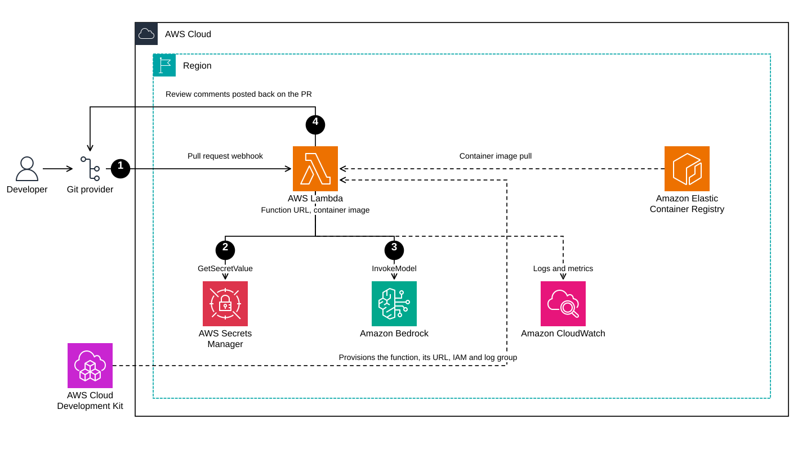

# pr-agent-lambda-cdk

Run [PR-Agent](https://github.com/The-PR-Agent/pr-agent), the open source AI code review agent, on AWS Lambda with Amazon Bedrock behind it.

A CDK stack plus the scripts around it. No image to build: PR-Agent publishes Lambda images on every release, so this copies one into your ECR and points a function at it. Your diffs go to a model you chose, in a region you chose, and nowhere else.

This is the companion repo to [Running a serverless AI code review agent on AWS Lambda with PR-Agent and CDK](https://dev.to/naorpeled). Clone it and run, or open `lib/pr-agent-lambda-stack.ts` and copy the parts you need.



## Prerequisites

- An AWS account, with the CLI v2 configured and credentials that can create IAM roles
- Docker running, to copy the image into ECR
- Node 20 or newer
- `jq` and `openssl`
- A GitHub App (see [Create the GitHub App](#1-create-the-github-app))

One thing to settle first, because it's the failure that looks least like itself. Bedrock foundation models are enabled by default in commercial regions, but the first invocation in an account kicks off an AWS Marketplace subscription in the background, so the calling identity needs `aws-marketplace:Subscribe` the first time. Anthropic models additionally want a one time First Time Use form, submitted per account or at the org's management account. Until both are done, every call returns `AccessDeniedException` no matter how correct your IAM policy is. Submit it from the Bedrock console's model catalog, or call `PutUseCaseForModelAccess`.

## Quick start

```bash
git clone https://github.com/naorpeled/pr-agent-lambda-cdk.git
cd pr-agent-lambda-cdk
make install

export WEBHOOK_SECRET=$(openssl rand -hex 32)
make secret APP_ID=123456 PEM=./my-app.private-key.pem
make image
make bootstrap deploy smoke
```

Then take the `WebhookUrl` from `make outputs` and paste it into your GitHub App.

`make` on its own lists every target.

## Step by step

### 1. Create the GitHub App

Under Settings, Developer settings, GitHub Apps:

1. Permissions: **Pull requests** read and write, **Issues** read and write, **Metadata** read only, **Contents** read only. Issues is the one that lets it post comments on a PR.
2. Subscribe to the **Pull request** and **Issue comment** events.
3. Under Webhook, tick **Active** and put `https://example.com` in the URL as a placeholder. GitHub won't save an active webhook without a URL, and you don't have the real one until after the deploy. Set a webhook secret here too.
4. Generate a private key and download the `.pem`.
5. Note the App ID, then install the App on the repos you want reviewed.

### 2. Store the credentials

```bash
export WEBHOOK_SECRET=<the secret you set in step 1>
make secret APP_ID=123456 PEM=./my-app.private-key.pem
```

This builds PR-Agent's flat dotted-key JSON and puts it in Secrets Manager **in the same region as everything else**, which matters more than it looks. PR-Agent's secrets provider builds its boto3 client without an explicit region, so a secret anywhere else fails the lookup, and the Lambda handler swallows that and falls back to environment variables. You end up with no App credentials and no webhook signature verification, announced only by a `Failed to get secrets from AWS Secrets Manager` line in the logs. `make smoke` checks for exactly that.

The script refuses an empty `WEBHOOK_SECRET`, because PR-Agent gates signature verification on a truthy value and `""` would leave your endpoint open to anyone who finds the URL.

### 3. Copy the image into ECR

```bash
make image              # amd64
make image ARCH=arm64   # 20% cheaper per GB-second
```

Lambda only pulls from ECR, and it rejects multi-architecture images. The published tag is a manifest covering both architectures, so the script pulls one platform explicitly and then verifies what landed is not an index. If you have Docker Desktop's containerd image store enabled it can push the whole index back, and the script will tell you.

### 4. Deploy

```bash
make bootstrap   # once per account and region
make deploy
```

There's no Docker build in the deploy path, so `cdk synth` runs entirely offline and `cdk deploy` is just CloudFormation.

### 5. Check it, then wire up the webhook

```bash
make smoke
```

That hits the health check at `/`, expects `{"status":"ok"}`, and then greps the recent logs for the secrets failure above, because a healthy response alone doesn't prove the secret was found.

Then put the `WebhookUrl` output into your GitHub App's webhook settings in place of the placeholder, leave the secret as it was, and open a test PR. `make logs` tails the function.

## Configuration

Every one of these is an environment variable, usable with `make` or `cdk` directly.

| Variable | Default | What it does |
|---|---|---|
| `REGION` | `us-east-1` | Region for the secret, ECR repo, function and profile. Keep them together. |
| `ARCH` | `amd64` | `amd64` or `arm64`. Must match what you pulled in `make image`. |
| `IMAGE_TAG` | `0.41.0-github_lambda` | Tag to copy. Use `gitlab_lambda` for GitLab. Pin a version. |
| `ECR_REPO` | `pr-agent` | ECR repository name. |
| `SECRET_NAME` | `pr-agent/config` | Secrets Manager secret name. |
| `STACK_NAME` | `PrAgentLambdaStack` | CloudFormation stack name. |
| `MODEL` | `us.anthropic.claude-sonnet-4-5-...` | Primary Bedrock model. |
| `FALLBACK_MODEL` | `us.anthropic.claude-haiku-4-5-...` | Tried when the primary raises. |
| `INFERENCE_REGIONS` | `us-east-1,us-east-2,us-west-2` | Regions the inference profile routes to. |
| `MEMORY_SIZE` | `2048` | Lambda memory in MB. Memory buys CPU. |
| `RESERVED_CONCURRENCY` | `5` | Caps concurrent reviews. Set empty to omit. |

Deploying outside the US means changing three things together:

```bash
make deploy \
  REGION=eu-west-1 \
  MODEL=eu.anthropic.claude-sonnet-4-5-20250929-v1:0 \
  FALLBACK_MODEL=eu.anthropic.claude-haiku-4-5-20251001-v1:0 \
  INFERENCE_REGIONS=eu-west-1,eu-central-1,eu-north-1
```

Confirm the region list rather than trusting the default, since profile membership is per model and changes:

```bash
aws bedrock get-inference-profile \
  --inference-profile-identifier us.anthropic.claude-sonnet-4-5-20250929-v1:0 \
  --query 'models[].modelArn' --region us-east-1
```

## Things worth knowing

**The review runs inside the invocation, not after it.** PR-Agent's webhook handler queues the review as a Starlette background task and returns `{}` immediately. Under gunicorn the response goes out first. On Lambda, Mangum runs the ASGI app with `loop.run_until_complete()` and Starlette awaits background tasks inside that same coroutine, so the review finishes before Lambda sees a response. That's the behavior you want, since Lambda freezes the environment the moment the handler returns, and it's why the timeout here is 5 minutes rather than a few seconds.

The visible consequence: GitHub waits 10 seconds and marks the delivery as timed out. The work still completes and the comments still get posted. If the red X bothers you, split it into a thin receiver that validates the signature and drops the payload on SQS, plus a worker Lambda.

**Bedrock needs two IAM statements.** A `us.` prefixed model id is a cross-region inference profile. When you put a profile in the `Resource` field you must *also* list the underlying foundation model in every region the profile routes to, and foundation-model ARNs have an empty account field. Grant only the profile ARN and you get access denied errors that look like they're about something else. The stack does both.

**The secret is for credentials, not configuration.** At cold start PR-Agent applies a key from the secret only when that setting is currently unset or empty, and only keys with exactly one dot are parsed at all. Anything with a default in PR-Agent's `configuration.toml` ignores what you put in the secret. Change behavior with `SECTION__KEY` environment variables instead.

**`max_model_tokens` defaults to 32000** and is applied as a ceiling on top of whatever the model can take. Left alone you'd use 32K of a 200K context window, so the stack sets it to 128000. Raising it raises your bill roughly in proportion.

**Cold starts are a few seconds** and SnapStart isn't an option, since it doesn't support container images. For a review nobody is watching in real time, that's noise.

**Re-running on new commits is off by default.** The trigger is the `synchronize` action on the Pull request event you already subscribed to, gated behind `github_app.handle_push_trigger`. Subscribing to the Push event doesn't turn it on.

## Cost

Lambda is the cheap part. At 2 GB, a 60 second review is 120 GB-seconds, roughly a fifth of a cent, so 500 reviews a month is about a dollar. Secrets Manager is $0.40 per secret per month and ECR storage is around $0.10 per GB per month, both bigger than the compute.

The model call is where the money goes and it scales with diff size. PR-Agent's compression strategy bounds how many tokens leave your account per review; running `/improve` on demand instead of on every PR saves the most.

## Teardown

```bash
make destroy
rm -f config.json *.pem
```

`cdk destroy` alone leaves the ECR repo and the secret behind, and both keep billing, so `make destroy` removes all three. The `CDKToolkit` bootstrap stack is left alone: it costs nothing when empty and is shared by every CDK app in that account and region.

## Development

```bash
make check   # typecheck, synth, shellcheck
```

CI runs the same thing on every push and PR, including an arm64 synth, so the repo can't drift into a state that doesn't compile.

## License

MIT. PR-Agent itself is MIT and community owned, and [contributions are welcome there too](https://github.com/The-PR-Agent/pr-agent/issues).
